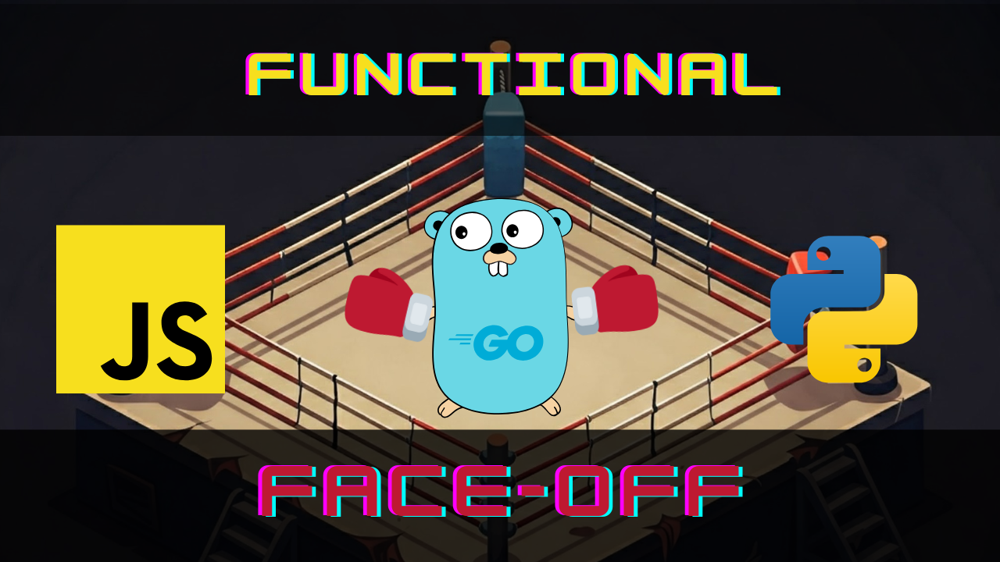

# Functional Programming Face-Off: Python vs JavaScript vs Go!

This repository contains the code examples and resources for my YouTube video where I compare and contrast the functional programming capabilities of Python, JavaScript, and Go.

## Video Description

In this video, we dive deep into the world of functional programming, exploring how Python, JavaScript, and Go each embrace (or sometimes resist) its core principles.

As a fan of functional programming, I'll guide you through a practical comparison of how these languages handle concepts like:

* **Defining Functions:** Basic syntax and type systems.
* **First-Class and Higher-Order Functions:** Treating functions as values and passing them to other functions.
* **Closures:**  Functions that "remember" their surrounding scope.
* **Partial Application:** Creating new functions by fixing some arguments.
* **Currying:** Transforming functions with multiple arguments into a sequence of single-argument functions.
* **Immutability:** Ensuring data remains unchanged.
* **Map/Filter/Reduce:**  Working with collections of data in a functional way.
* **Compose:** Combining simple functions to build complex operations.

We'll evaluate which language offers the most natural and concise support for functional programming, considering built-in features and syntax. Join me as we explore the functional side of Python, JavaScript, and Go!

## Let's Connect!

* **YouTube:** [Let's Talk Dev YouTube Channel Link](https://www.youtube.com/channel/UC_tS0kNJZXkMZn2mRJRTA_g)
* **Blog:** [Dev.to Blog](https://dev.to/mihailtd)
* **LinkedIn:** [Mihai Farcas - Software Architect (LinkedIn Profile)](https://www.linkedin.com/in/mihai-farcas-ltd)

**Happy coding!**